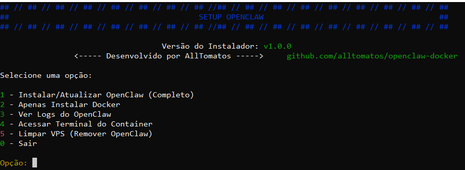

# 🦞 OpenClaw Docker - Ambiente de Produção

Este repositório contém a configuração completa para rodar o **OpenClaw** em containers Docker, otimizado com Ubuntu 24.04 LTS, Node.js 22 e suporte total a automação de navegadores (Playwright).

## 🚀 Funcionalidades

- **Base Robusta**: Ubuntu 24.04 LTS + Node.js 22.
- **Navegadores Pré-instalados**: Chromium, Firefox e WebKit (via Playwright) prontos para uso.
- **Gerenciamento de Processos**: Utiliza **PM2** para manter o agente sempre online.
- **Suporte a Cluster**: Detecção automática de **Docker Swarm** e integração nativa com **Traefik** (Load Balancer).
- **Gestão de Skills**:
  - Injeção segura de skills via diretório local.
  - **Auto-Reload Diário**: O sistema verifica novas skills automaticamente todo dia às 03:00 AM.
  - Instalação automática de dependências (`npm install`) para novas skills.
- **Segurança**: Executa como usuário não-root (`openclaw`).

---

## 🛠️ Instalação e Uso

### Pré-requisitos
- Docker & Docker Compose instalados.
- Linux/WSL2 (Recomendado).

### ☁️ Instalação em VPS (Produção)

Para facilitar o deploy em servidores VPS (Ubuntu/Debian), criamos o **SetupOpenclaw**, um script automatizado que configura todo o ambiente utilizando Docker Swarm (opcional) e integra-se nativamente com o Traefik.

✨ **O que o SetupOpenclaw faz:**

*   Instala dependências (Docker, Docker Compose, Git).
*   Configura o ambiente (Standalone ou Cluster/Swarm).
*   Gera e implanta a Stack completa do OpenClaw.
*   Integração automática com **Traefik** (se detectado) para Proxy Reverso e SSL.

🚀 **Como usar:**

Acesse seu servidor via SSH como `root` e execute o comando abaixo:

```bash
curl -sL https://raw.githubusercontent.com/alltomatos/openclaw-docker/main/SetupOpenclaw.sh -o SetupOpenclaw.sh && chmod +x SetupOpenclaw.sh && ./SetupOpenclaw.sh
```



Siga as instruções do menu interativo. O script detectará automaticamente se é necessário instalar a infraestrutura e guiará você passo-a-passo. Você poderá escolher entre o modo **Cluster (Swarm + Traefik)** ou **Standalone (Docker Puro)**.

> **Nota:** Se o script detectar um cluster Swarm com Traefik, ele oferecerá a opção de configurar o OpenClaw como um serviço replicado e acessível via domínio (ex: `openclaw.app.localhost`).

### 🔐 Segurança (Opcional)

Se você estiver rodando em **Swarm com Traefik**, pode proteger o acesso ao OpenClaw com uma senha (Token).
Edite o arquivo `docker-compose.swarm.yml` e descomente as linhas de **Basic Auth**.

Para gerar o hash da senha:
```bash
# Instale o utilitário (se não tiver)
sudo apt install apache2-utils

# Gere o hash (substitua 'seu_token' pela senha desejada)
htpasswd -nb admin seu_token
# Saída: admin:$apr1$.......
```
Copie a saída e cole na label `traefik.http.middlewares.openclaw-auth.basicauth.users` no arquivo `docker-compose.swarm.yml`.

### Opção 2: Instalação Manual
1. Iniciar o Agente:
```bash
docker compose up -d
```

### 2. Configuração Inicial (Onboarding)
Se for a primeira vez, você precisará configurar suas chaves de API (LLM) e canais:
```bash
docker compose exec openclaw openclaw onboard
```


---

## 🧠 Gerenciamento de Skills

Este ambiente possui um sistema avançado e automatizado para gerenciamento de capacidades (Skills), permitindo estender o OpenClaw com novas funcionalidades.

### Skills Suportadas
O sistema de **Auto-Reload** detecta e instala dependências automaticamente para:
- **Node.js**: Projetos com `package.json` (instala via `npm install`).
- **Python**: Projetos com `requirements.txt` (instala via `pip install --user`).

### Skills Pré-instaladas
- **DuckDuckGo Search**: Permite que o agente realize pesquisas na web anônimas (texto, imagens, notícias) sem necessidade de API Key. Documentação completa em `./skills/duckduckgo-search-1.0.0/SKILL.md`.

### Como adicionar uma nova Skill

1.  **Clone a skill** para a pasta `./skills` na raiz deste projeto.
    Use o script facilitador para fazer isso de forma segura e organizada:
    ```bash
    ./add_skill.sh https://github.com/usuario/repo-da-skill
    ```

2.  **Ativação**:
    *   **Opção A (Automática)**: O sistema roda um scan diário às **03:00 AM**. Ele detecta novas pastas, instala as dependências (Node/Python) e recarrega o agente.
    *   **Opção B (Manual/Imediata)**: Force a detecção e instalação agora mesmo sem reiniciar o container:
        ```bash
        docker compose exec openclaw /usr/local/bin/scan_skills.sh
        ```
    *   **Opção C (Reinício Total)**:
        ```bash
        docker compose restart openclaw
        ```

### Estrutura de Diretórios
O diretório `./skills` do seu host é mapeado diretamente para dentro do container, facilitando o desenvolvimento.

```text
.
├── skills/                  # Suas skills locais (Git Repos)
│   ├── duckduckgo-search/   # Skill Python (com requirements.txt)
│   ├── outra-skill-node/    # Skill Node.js (com package.json)
│   └── ...
├── docker-compose.yml       # Orquestração
└── ...
```

---

## 🐳 Desenvolvimento e Manutenção

### Construir a Imagem Localmente
Se você fez alterações no Dockerfile e quer testar localmente:
```bash
docker build -t watink/openclaw:latest .
```

---

## 📂 Volumes e Persistência

| Volume | Caminho no Container | Descrição |
|--------|----------------------|-----------|
| `openclaw_config` | `/home/openclaw/.openclaw` | Armazena configurações, chaves de API e sessões. |
| `openclaw_workspace` | `/home/openclaw/workspace` | Arquivos gerados pelo agente durante o uso. |
| `./skills` (Bind Mount) | `/home/openclaw/workspace/skills` | Sincronização direta das suas skills locais. |

---

## 🔍 Troubleshooting

**Verificar logs do agente:**
```bash
docker compose logs -f openclaw
```

**Verificar status do PM2 (Gerenciador de Processos):**
```bash
docker compose exec openclaw pm2 status
```

**Verificar logs de instalação de skills:**
```bash
docker compose exec openclaw cat /home/openclaw/workspace/skill_scan.log
```
